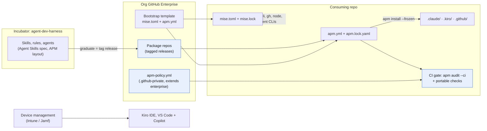

# Cross-Tool Agent Toolkit Distribution: Evaluation and Recommendation

**Date:** 2026-09-24
**Status:** Recommendation, pending the Windows validation spike and an ADR
**Tracking:** beads epic `claude-config-39u`

## TL;DR

Manage agent context and OS tooling as two lockfile-pinned manifests per repo, both verified in CI:

- **APM (microsoft/apm)** handles skills, rules, agents, hooks and MCP config. From one package it deploys native files for Claude Code, Kiro and GitHub Copilot, pins sources in a lockfile, and detects drift and policy violations with `apm audit --ci`. A hands-on spike on macOS confirmed all of this with our real skills and rules (see [Spike results](#spike-results-apm-v0310-macos)).
- **mise** is the leading candidate for the OS layer: `bd`, `jq`, `aws-cli`, `gh`, `node`, `apm` and the agent CLIs, on macOS and Windows. It is not validated yet; that is the next spike.

Keystone is rejected because it has no Kiro or Copilot support. pi is useful only as a building block for headless platform agents; it should not become a fourth end-user tool.

## Problem and context

We run an agentic development enablement program on three agent tools:

| Tool | Models | Surface |
|---|---|---|
| Claude Code | Anthropic and other models via AWS Bedrock | CLI and IDE |
| AWS Kiro | Bedrock | IDE and CLI |
| GitHub Copilot | Copilot's built-in models | VS Code, JetBrains, CLI, cloud agent |

Engineers use both macOS and Windows. Skills, rules and workflows are incubated in a personal toolkit repo (`agent-dev-harness`) and spun out to the org once proven. Across hundreds of installations, three kinds of drift make this hard:

1. **Content drift:** a team edits its local copy of a rule or skill, and it silently diverges.
2. **Version drift:** installs stop updating and run stale versions.
3. **Tool drift:** the same intent is written three ways, once per tool format, and the copies diverge.

OS dependencies drift too. The incubator currently installs them with a macOS-only Brewfile and a bash `setup.sh`, and copies rules with `install-to-project.sh --force`. That approach is macOS-only, Claude-only, copy-based and has no drift detection.

## Goals and non-goals

**Goals**

- One authored source for skills, rules and workflows that produces native config for all three tools.
- Pinned versions and automated drift detection in every consuming repo's CI.
- Central policy that can only get stricter as it passes down: enterprise, then org, then repo.
- One bootstrap path for OS-level CLI tools on macOS and Windows.
- A cheap path from incubated to published: graduation is a tagged release, not a copy.

**Non-goals**

- Installing IDE applications (Kiro IDE, VS Code, the Copilot extension). Those belong to device management (Intune, Jamf), not to a repo manifest.
- Replacing any of the three agent tools.
- Model or provider choice.

## The portability landscape

Standards have converged enough that most content is already portable. The remaining problem is translating per-tool formats and handling a few genuinely tool-specific features.

| Primitive | Claude Code | Kiro | Copilot | Portable? |
|---|---|---|---|---|
| Skills (`SKILL.md`, Agent Skills spec) | `.claude/skills/` | `.kiro/skills/` (since Feb 2026) | `.github/skills/`, `.agents/skills/`, also reads `.claude/skills/` | Yes |
| Always-on guidance | `CLAUDE.md`, `.claude/rules/` | `.kiro/steering/` (`inclusion: always`), `AGENTS.md` (since Aug 2026) | `.github/copilot-instructions.md`, `AGENTS.md` | Mostly |
| Glob-scoped rules | `.claude/rules/` with `paths:` | `.kiro/steering/` with `fileMatch` | `.github/instructions/*.instructions.md` with `applyTo` | Needs translation |
| Hooks | `settings.json` | `.kiro/hooks/` | `.github/hooks/` | Tool-specific |
| Agents / subagents | `.claude/agents/` | `.kiro/agents/` | `.github/agents/*.agent.md` | Tool-specific |
| MCP servers | `.mcp.json` | `.kiro/settings/mcp.json` | per surface | Tool-specific |

Two design consequences follow from this table.

**Enforce in CI, not in agent hooks.** Hooks are the least portable primitive, and Copilot runs a different set of models from the other two tools. A rule that must hold (tests pass, actions are SHA-pinned, no secrets committed, no config drift) belongs in a CI check that runs whichever tool wrote the code. Agent hooks are a convenience layered on top.

**Author for the weakest model.** Copilot's built-in models follow long, subtle skills less reliably than Claude on Bedrock. Skills need precise descriptions, explicit triggers and procedural bodies, with no Claude-only tool names. A skill that works on Copilot's built-in models is ready to spin out.

## Options evaluated

### Agent context layer

| | **APM** (microsoft/apm) | rulesync | Keystone (tacoda/keystone) |
|---|---|---|---|
| Claude Code / Kiro / Copilot | ✅ / ✅ / ✅ | ✅ / ✅ / ✅ | ✅ / ❌ / ❌ |
| Model | Package manager: `apm.yml` + `apm install` | Generator from one source | Charter generator |
| Version pinning | Lockfile with resolved commit and per-file sha256 | Remote fetch, weaker | Policy lockfile |
| Org governance | `apm-policy.yml` with allow/deny/require, `extends` inheritance, warn/block modes | None | Project overrides with `strict` locks |
| Drift detection | `apm audit --ci` replays the install and diffs it | `--check` | `verify`, `conformance` |
| Supply-chain checks | Hidden-Unicode scan, SARIF output, SBOM export, consent for transitive MCP servers | None | None |
| Sources | Any git host, including GitHub Enterprise and Azure DevOps | git | Policy repos |
| Windows | Native x86_64 binary | Node | Go binary |
| Maturity (Sept 2026) | About 3.9k stars, about 2k commits, Microsoft org, v0.31.0 | About 1.5k stars | About 44 stars, one maintainer, v4 had breaking renames |
| **Recommendation** | **Adopt, subject to Windows validation** | Fallback | Reject |

**Why APM over rulesync:** rulesync covers our three tools and is a reasonable fallback, but it generates config and does not govern it. APM adds what an enablement team at our scale needs: lockfile provenance, org policy with inheritance, and a single CI gate that catches content drift, version drift and injected content together.

**Why not Keystone:** its ideas are good (sensors that turn prose rules into gates, and a charter override model), but it targets Claude Code, Cursor, Codex and opencode only. We keep the sensor idea as the "enforce in CI" principle above.

### Runtime: pi (earendil-works/pi)

pi is a minimal, MIT-licensed coding agent harness (about 109k stars) with 15+ providers including Bedrock, Agent Skills support, TypeScript extensions, and SDK and RPC modes. It deliberately leaves out MCP, subagents, permission prompts and plan mode.

As a fourth end-user tool it would increase drift, and its missing permission model conflicts with enterprise security posture. Where it fits is as the base for **org-owned headless agents** (CI review bots, migrations, triage) running multiple models on Bedrock, with governance and audit logging built as extensions. An open APM pull request adds pi as a target ([#2907](https://github.com/microsoft/apm/pull/2907)); if it merges, the same packages would serve both end-user tools and headless agents. This is tracked as a low-priority evaluation.

### OS dependency layer

APM manages agent context only. Its experimental `apm runtime` command installs only the Copilot CLI, Codex, Gemini and llm, not Claude Code, Kiro or any general tooling, so a second tool is required.

| | **mise** | winget + Brewfile | Dev containers | Nix |
|---|---|---|---|---|
| macOS + Windows from one manifest | Yes (`mise.toml`) | No, two manifests | Yes, via Docker/WSL | No native Windows |
| Per-repo pinned versions | Yes, plus `mise.lock` with provenance verification | No | Yes (image) | Yes |
| Covers our tool list | Probably, via aqua, GitHub-release, npm and pipx backends (to verify) | Yes | Yes | Mostly |
| Can bootstrap APM content | Yes, via mise tasks (`mise run bootstrap` → `apm install --frozen`) | Script glue | `postCreateCommand` | Script glue |
| Friction | Low | Two scripts to maintain | High on Windows laptops; Kiro dev container support unverified | High |
| **Recommendation** | **Spike next** | Fallback | Only for specific repos | Reject |

Known risk for the mise spike: Windows packaging of `bd` has had PATH problems via winget (gastownhall/beads#4908), and `aws-cli` on Windows ships as an MSI, which may not fit mise's portable-binary model. Both need a real Windows run.

## Proposed architecture



The arrows point from sources of truth toward installations. Each consuming repo holds only two small manifests and their lockfiles, while everything it deploys (the `.claude/`, `.kiro/` and `.github/` trees) is generated and hash-tracked. Local edits to generated files therefore fail CI, instead of drifting silently. Org policy lives in the org's `.github-private` repo and is discovered from the git remote, so a repo cannot opt out by omitting a file. IDE applications stay with device management because they are machine-level installs with their own update channels.

**Graduation flow:** a skill proves out in the incubator, gets a tagged release in an org package repo, and is added to the policy allowlist (or `require` list for mandatory standards). Teams pick it up with `apm update`, and `apm outdated` shows fleet version lag.

## Spike results: APM v0.31.0, macOS

The spike used real content from the incubator: 3 skills (`task-completion`, `intake-report`, `security-sweep` with its reference files) and 3 rules (two always-on, one glob-scoped), packaged in APM layout, installed into a scratch consumer repo for `claude,kiro,copilot`. The binary came from the GitHub release with its sha256 checksum verified. The PyPI package `apm-cli` lists no project URLs, so we should install from the release binary, not PyPI.

| Test | Result |
|---|---|
| Deploy to all three tools from one package | ✅ 3 skills and 3 rules written natively to `.claude/`, `.kiro/`, `.github/` + `.agents/skills/` |
| Glob-scoped rule translation | ✅ `applyTo` became Claude `paths:`, Kiro `inclusion: fileMatch` + `fileMatchPattern`, Copilot `applyTo` |
| Always-on rule translation | ⚠️ Works only if `applyTo` is **omitted** (Kiro gets `inclusion: always`). `applyTo: "**"` becomes a file-match rule instead. Copilot needs `apm compile -t copilot` to fold always-on rules into `copilot-instructions.md`. |
| Consume a plain Claude skill repo, pinned to a commit SHA | ✅ `anthropics/skills/skills/frontend-design#<sha>`; lockfile recorded `resolved_commit` |
| Lockfile integrity | ✅ Per-file sha256 for every deployed file |
| Drift: hand-edit one deployed Kiro steering file | ✅ `apm audit --ci` exits 1 and names the file; `apm install` restores it |
| Hidden Unicode: inject bidi override + zero-width space into a skill | ✅ CRITICAL findings with line and column, exits 1 |
| Policy: allowlist + required package, `enforcement: block` | ✅ Flags 2 non-allowlisted dependencies and 1 missing required package, exits 1 |
| **Policy file invalid** | ❌ **Fails open.** Enforcement is skipped with a warning and the audit exits 0. The `require:` example in APM's own governance guide fails the validator this way. |
| Policy fail-closed setting (`policy.fetch_failure_default: block` in `apm.yml`) | ✅ Invalid policy then exits 1 |
| No discoverable org (local git remote) | ⚠️ Also fails open unless the fail-closed setting is set |

**Findings that shape the rollout**

1. **Set fail-closed everywhere.** The bootstrap template must include `policy.fetch_failure_default: block`, and the org policy itself should be validated in its own repo's CI, because a malformed policy silently disables governance.
2. **Skills are deployed in triplicate** (`.claude/skills`, `.kiro/skills`, `.agents/skills`). That is correct, but Copilot also reads `.claude/skills`, so we need to confirm Copilot doesn't show duplicate skills.
3. **Always-on rules need an authoring convention:** omit `applyTo`, and run `apm compile` for Copilot as part of bootstrap.
4. **Skill bodies still reference Claude-only constructs** (`Skill(kf:...)`, `ce:*` skills, beads-specific steps). APM moves the files correctly; making them work in Kiro and Copilot is a content task (`claude-config-39u.3`).

**Not yet tested:** Windows, hooks/agents/MCP translation, private GitHub Enterprise sources and auth, `apm update` and `apm outdated` workflows, and runtime behavior inside Kiro and Copilot (whether each tool actually loads and triggers the deployed files).

## Tradeoffs and risks

| Risk | Likelihood | Mitigation |
|---|---|---|
| APM is pre-1.0 (v0.31) and may make breaking changes | Medium | Pin the APM version via mise; the deployed output is plain files that keep working if we stop using APM |
| Policy fails open on errors | High without mitigation | Fail-closed setting in the template; CI-validate the policy repo |
| Two maintainers named on APM | Low–Medium | MIT license; output is tool-independent; rulesync as fallback |
| Windows gaps in mise backends (`bd`, `aws-cli`) | Medium | Windows spike before any decision; winget fallback for individual tools |
| Weaker Copilot models misfire on skills | High | Author for the weakest model; test skills on Copilot's built-in models before graduation |
| Lose Claude plugin marketplace `plugin update` flow | Low | Run the kf Claude plugin in parallel during migration; APM can also consume plugin collections |

## Success metrics

- Every onboarded repo passes `apm audit --ci` with a fail-closed policy on its default branch.
- Time from graduating an incubated skill to availability in all three tools: under one day (a tag plus a policy PR).
- Fleet version lag: 90% of repos within one minor version of each required package, measured with `apm outdated`.
- New-machine bootstrap on macOS and Windows: one command, under 15 minutes, no manual steps.

## Open questions

| Question | Status |
|---|---|
| Does mise cover `bd`, `dolt`, `aws-cli`, `gh`, `jq`, `node`, `apm`, Claude Code CLI, Copilot CLI and Kiro CLI on Windows? | Tracked: `claude-config-39u.2` |
| Does APM's output behave correctly inside Kiro and Copilot, and on Windows? | Tracked: `claude-config-39u.1` (remaining items) |
| Final choice and migration path for the kf Claude plugin | Tracked: `claude-config-39u.6` (ADR-002, blocked on both spikes) |
| Aligning `kf:spec-first` with Kiro's native EARS-based specs | Tracked: `claude-config-39u.4` |
| Which prose rules become CI checks | Tracked: `claude-config-39u.5` |
| pi as a headless agent base | Tracked: `claude-config-39u.7`, low priority |

## Appendix: reproducing the spike

```bash
# Install APM from the verified release binary (not PyPI)
gh release download v0.31.0 --repo microsoft/apm -p 'apm-darwin-arm64.tar.gz*'
shasum -a 256 -c apm-darwin-arm64.tar.gz.sha256 && tar xzf apm-darwin-arm64.tar.gz

# Producer package layout
#   apm.yml                                  name, version, description
#   .apm/skills/<name>/SKILL.md              copied from plugins/kf/skills/
#   .apm/instructions/<name>.instructions.md rule body + frontmatter:
#       description: "..."
#       applyTo: "<globs>"                   omit entirely for always-on rules

# Consumer
apm install <package-path-or-owner/repo/path#ref> --target claude,kiro,copilot
apm compile -t copilot                        # folds always-on rules into copilot-instructions.md
apm audit --ci --policy ./apm-policy.yml      # drift + integrity + policy gate

# Minimal valid policy (require is a list of strings, not objects)
#   enforcement: block
#   dependencies:
#     allow: ["contoso/*"]
#     require: ["contoso/web-standards"]
# And in the consumer's apm.yml:
#   policy:
#     fetch_failure_default: block
```

## Sources

- APM: [docs](https://microsoft.github.io/apm/), [targets matrix](https://microsoft.github.io/apm/reference/targets-matrix/), [governance guide](https://microsoft.github.io/apm/enterprise/governance-guide/), [repo](https://github.com/microsoft/apm), issues [#2671](https://github.com/microsoft/apm/issues/2671) (Kiro agent config), [#2975](https://github.com/microsoft/apm/issues/2975) (per-primitive targets), PR [#2907](https://github.com/microsoft/apm/pull/2907) (pi target)
- rulesync: [repo](https://github.com/dyoshikawa/rulesync)
- Keystone: [site](https://www.tacoda.dev/keystone/), [guide](https://www.tacoda.dev/keystone/guide.html), [reference](https://www.tacoda.dev/keystone/docs.html), [repo](https://github.com/tacoda/keystone)
- pi: [site](https://pi.dev), [repo](https://github.com/earendil-works/pi), [skills](https://github.com/earendil-works/pi/blob/main/packages/coding-agent/docs/skills.md), [extensions](https://github.com/earendil-works/pi/blob/main/packages/coding-agent/docs/extensions.md)
- Kiro: [skills](https://kiro.dev/docs/skills/), [steering](https://kiro.dev/docs/steering/), [0.9 changelog](https://kiro.dev/changelog/ide/0-9/)
- Copilot: [agent skills](https://docs.github.com/en/copilot/how-tos/copilot-on-github/customize-copilot/customize-cloud-agent/add-skills), [VS Code agent skills](https://code.visualstudio.com/docs/agent-customization/agent-skills)
- mise: [lockfile](https://mise.jdx.dev/dev-tools/mise-lock.html), [aqua backend](https://mise.jdx.dev/dev-tools/backends/aqua.html), [registry](https://mise.jdx.dev/registry.html)
- beads on Windows: [gastownhall/beads#4908](https://github.com/gastownhall/beads/issues/4908)
